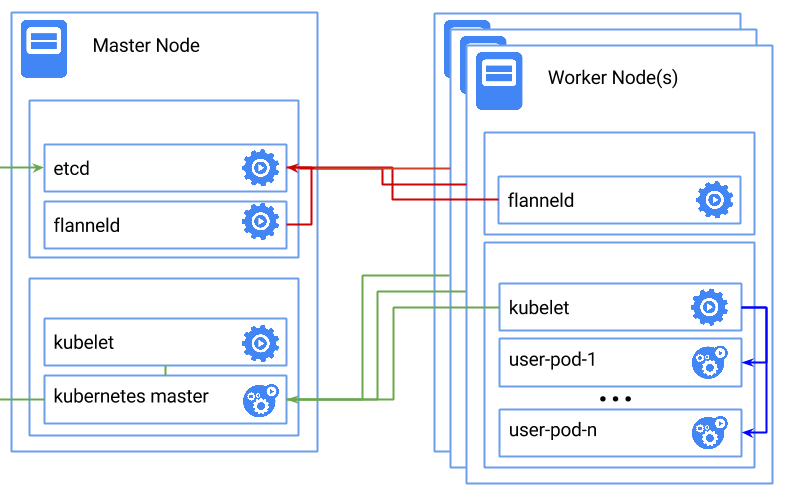
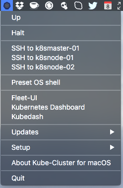

Kubernetes Cluster for macOS
============================


**Kube-Cluster for macOS** is `status bar app` which allows in an easy way to control and bootstrap multi-node (master+ two nodes) Kubernetes cluster on three [CoreOS](https://coreos.com) VMs.

**Includes:** [Helm Classic](https://helm.sh) - The Kubernetes Package Manager. 

**Includes:** An option from shell to install [Deis Workflow](https://deis.com) on top of Kubernetes: `$ install_deis`

**Kube-Cluster App** can be used together with [CoreOS VM App](https://github.com/TheNewNormal/coreos-osx) which allows to build Docker containers and has a private local Docker registry v2 which is accessible from Kube-Cluster App.



Download
--------
Head over to the [Releases Page](https://github.com/TheNewNormal/kube-cluster-osx/releases) to grab the latest release.


How to install Kube-Cluster
----------

**Requirements**
 -----------
  - **macOS 10.10.3** Yosemite or later 
  - Mac 2010 or later for this to work
  - [Corectl App](https://github.com/TheNewNormal/corectl.app) is installed
  - **Note:** For the fresh install it is recommended to restart your Mac if you have used VirtualBox based VM, as the VirtualBox sometimes messes up networking.


###Install:

Open downloaded `dmg` file and drag the App e.g. to your Desktop. Start the `Kube-Cluster` and `Initial setup of Kube-Cluster VMs` will run.

* All dependent files/folders will be put under `kube-cluster` folder in the user's home folder e.g `/Users/someuser/kube-cluster`
* user-data file will have fleet, etcd and flannel set
* Will download latest CoreOS ISO image (if there is no such) and run `corectl` to initialise VM 
* When you first time do install or 'Up' after destroying Kube-Cluster setup, k8s binary files (with the version which was available when the App was built) get copied to CoreOS VMs, this speeds up Kubernetes cluster setup. 
* It will install `fleetctl, kubectl, helmc and deis` clients to `~/kube-cluster/bin/`
* Kubernetes services will be installed with fleet units which are placed in `~/kube-cluster/fleet`, this allows very easy updates to fleet units if needed.
* [Fleet-UI](http://fleetui.com) via unit file will be installed to check running fleet units
* [Kubernetes Dashboard](http://kubernetes.io/docs/user-guide/ui/), [DNS](https://github.com/kubernetes/kubernetes/blob/release-1.2/cluster/addons/dns/README.md) and [Kubedash](https://github.com/kubernetes/kubedash) will be instlled as add-ons
* Via assigned static IPs (which will be shown on first boot and will survive VMs reboots) you can access any port on any CoreOS VM
* Persistent disks `xxx-data.img` will be created and mounted to VMs `/data` for these mount binds:

```
/data/var/lib/docker -> /var/lib/docker
/data/var/lib/rkt -> /var/lib/rkt
/data/var/lib/etcd2 -> /var/lib/etcd2
/data/opt/bin -> /opt/bin
``` 

How it works
------------

Just start `Kube-Cluster` application and you will find a small icon with the Kubernetes logo in the Status Bar.

* There you can `Up`, `Halt`, `Reload` CoreOS VMs
* Under `Up` and `OS Shell` OS Shell (terminal) will have such environment set:
````
1) kubernetes master - export KUBERNETES_MASTER=http://192.168.64.xxx:8080
2) etcd endpoint - export ETCDCTL_PEERS=http://192.168.64.xxx:2379
3) fleetctl endpoint - export FLEETCTL_ENDPOINT=http://192.168.64.xxx:2379
4) fleetctl driver - export FLEETCTL_DRIVER=etcd
5) Path to ~/kube-cluster/bin where fleetctl, helmc and kubectl are stored
````

* `Updates/Update Kubernetes to latest stable version` will update to latest stable version of Kubernetes.
* `Updates\Change Kubernetes version` allows you to insatll any Kubernetes version available on github.com.
* `Updates/Update macOS fleetctl, helmc and deis clients` will update fleetctl to the same versions as Kube-Cluster Master runs and helmc and deis to the latest versions.
* `SSH to k8smaster01 and k8snode-01/02` menu options will open VMs shell
* [Fleet-UI](http://fleetui.com) dashboard will show running fleet units and etc
* [Kubernetes Dashboard](http://kubernetes.io/docs/user-guide/ui/) will show nice Kubernetes Dashboard, where you can check Nodes, Pods, Replication, Deployments, Service Controllers, deploy Apps and etc.
* [Kubedash](https://github.com/kubernetes/kubedash) is a performance analytics UI for Kubernetes Clusters


Example ouput of succesfull CoreOS + Kubernetes cluster install:

````
$ 
etcd cluster:
/registry
/coreos.com

fleetctl list-machines:
MACHINE		IP		METADATA
9b88a46c...	192.168.64.3	role=node
d0c68677...	192.168.64.4	role=node
f93b555e...	192.168.64.2	role=control

fleetctl list-units:
UNIT				MACHINE				ACTIVE	SUB
fleet-ui.service				f93b555e.../192.168.64.2	active	running
kube-apiserver.service			f93b555e.../192.168.64.2	active	running
kube-controller-manager.service	f93b555e.../192.168.64.2	active	running
kube-kubelet.service			9b88a46c.../192.168.64.3	active	running
kube-kubelet.service			d0c68677.../192.168.64.4	active	running
kube-proxy.service				9b88a46c.../192.168.64.3	active	running
kube-proxy.service				d0c68677.../192.168.64.4	active	running
kube-scheduler.service			f93b555e.../192.168.64.2	active	running

kubectl get nodes:
NAME           LABELS                                             STATUS    AGE
192.168.64.8   kubernetes.io/hostname=k8snode-01,node=worker1   Ready     1h
192.168.64.9   kubernetes.io/hostname=k8snode-02,node=worker2   Ready     1h

````


Usage
------------

You're now ready to use Kubernetes cluster.

Some examples to start with [Kubernetes examples](http://kubernetes.io/docs/samples/q).

Other CoreOS VM based Apps for macOS
-----------
* Kubernetes Solo Cluster VM App can be found here [Kube-Solo for macOS](https://github.com/TheNewNormal/kube-solo-osx).

* Standalone CoreOS VM App (good for docker images building and testing) can be found here [CoreOS VM for macOS](https://github.com/TheNewNormal/coreos-osx).

* CoreOS Cluster App without Kubernetes can be found here [CoreOS Cluster for macOS](https://github.com/rimusz/coreos-osx-cluster).

## Contributing

**Kube-Cluster for macOS** is an [open source](http://opensource.org/osd) project release under
the [Apache License, Version 2.0](http://opensource.org/licenses/Apache-2.0),
hence contributions and suggestions are gladly welcomed!
